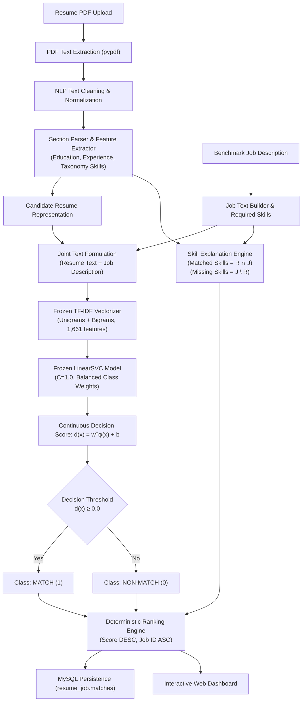
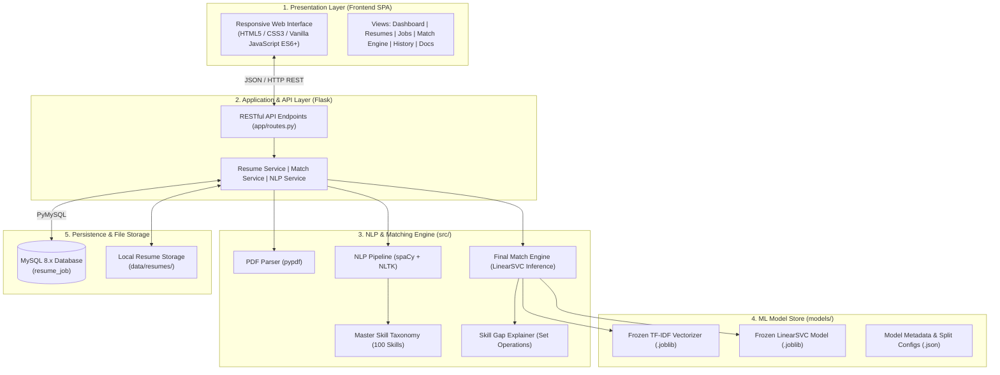
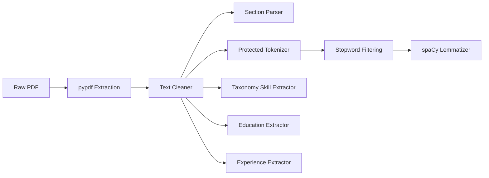
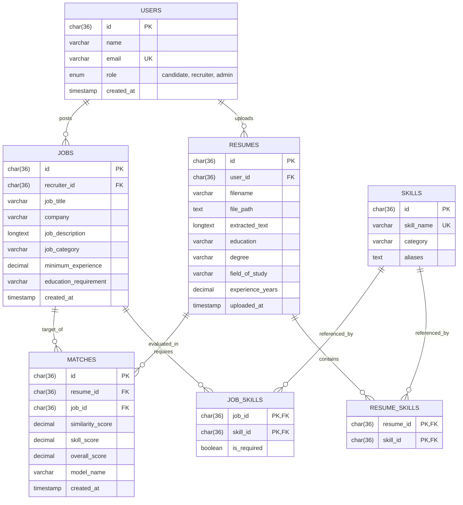

# AI-Based Resume Screening and Job Matching System

An academic Natural Language Processing (NLP) and Machine Learning (ML) project developed for automated candidate resume screening, structured information extraction, job compatibility classification, deterministic ranking, and skill gap explanation.

---

## 1. Overview

The **AI-Based Resume Screening and Job Matching System** is an intelligent software solution designed to streamline the academic study and practical implementation of automated recruitment screening. Traditional recruitment workflows require recruiters to manually read and evaluate hundreds of unstructured candidate resumes against technical job descriptions—a process that is time-consuming, prone to human inconsistency, and difficult to standardize.

This project addresses the screening challenge by combining:
1. **Rule-augmented NLP feature extraction** (document parsing, section segmentation, controlled technical tokenization, taxonomy-based skill extraction, education, and experience parsing).
2. **Machine Learning classification and ranking** (numerical representation of resume-job text pairs, supervised classification using Linear Support Vector Machines, and deterministic score-based candidate-to-job ranking).
3. **Transparent skill gap explanation** (computing exact matched competencies and missing skill gaps to provide interpretable decision-support indicators).

Conceptually, the system serves both **recruiters** (who need ranked candidate evaluations with transparent skill breakdowns) and **candidates** (who need to understand qualification alignments and actionable skill gaps). The system produces structured profile extractions, signed compatibility decision scores, binary match classifications, and explainable skill matrices delivered through a unified web interface and RESTful APIs.

---

## 2. Problem Statement

Manual resume screening presents several challenges in recruitment and academic talent matching:
- **High Volume & Cognitive Load:** Evaluating large numbers of multi-page PDF resumes against diverse job descriptions is cognitively demanding and inefficient.
- **Unstructured Text Heterogeneity:** Resumes vary widely in layout, phrasing, terminology, and formatting, making direct string matching unreliable.
- **Black-Box Decision Making:** Generic automated filters often reject candidates without actionable justification, making it impossible for candidates or recruiters to understand why a candidate did not qualify.
- **Evaluation Validity & Data Leakage:** In machine learning literature, evaluating models on randomly split resume-job pairs frequently leads to severe data leakage if the same candidate appears in both training and test partitions.

This project implements an automated, explainable, and academically validated system that processes unstructured resume PDFs, computes machine learning compatibility predictions with zero candidate-level evaluation leakage, and provides clear skill-level explanations.

---

## 3. Objectives

- **Automate Resume Ingestion:** Extract clean textual data from candidate PDF documents reliably using `pypdf`.
- **Extract Structured Features:** Identify sections (Experience, Education, Skills, Projects, Certifications), parse years of experience, identify academic degrees, and detect domain competencies.
- **Standardize Skill Extraction:** Map diverse technical terms and aliases to a curated 100-skill canonical taxonomy across 7 technical categories.
- **Formulate Text Representations:** Transform joint candidate-job text pairs into high-dimensional TF-IDF feature representations capturing unigrams and bigrams.
- **Evaluate Multiple Machine Learning Paradigms:** Implement and rigorously benchmark four distinct approaches:
  1. *TF-IDF + Cosine Similarity* (Unsupervised lexical baseline)
  2. *TF-IDF + Linear Support Vector Classifier* (Supervised linear margin classifier)
  3. *TF-IDF + Artificial Neural Network / MLP* (Supervised dense neural network)
  4. *Word Embedding + LSTM* (Supervised recurrent sequence architecture)
- **Select an Optimal Matching Model:** Select a primary model based on generalization performance, specificity, false positive suppression, interpretability, and execution efficiency.
- **Provide Explainable Matching:** Compute exact matched competencies ($Resume \cap Job$), missing requirements ($Job \setminus Resume$), and skill overlap ratios.
- **Ensure Deterministic Ranking:** Rank multiple job opportunities for a candidate deterministically based on signed decision scores with consistent tie-breaking.
- **Maintain Relational Data Integrity:** Persist users, resumes, benchmark jobs, taxonomy skills, and match evaluations using a relational MySQL schema.
- **Deliver an Interactive Interface:** Provide a single-page web interface (HTML5/CSS3/JavaScript ES6+) for resume upload, feature inspection, batch multi-job matching, and evaluation comparison.

---

## 4. Key Features

- **PDF Resume Upload & Text Extraction:** Ingests candidate PDF files, parses document streams, and handles multi-column textual layouts.
- **NLP Preprocessing Pipeline:** Cleans noise, normalizes text, parses distinct resume sections, tokenizes with special technical term preservation (e.g., `C++`, `C#`, `.NET`, `Node.js`, `CI/CD`), removes non-technical stopwords, and performs spaCy-based lemmatization.
- **Taxonomy-Driven Skill Extraction:** Uses boundary-aware regular expressions and alias dictionaries to extract canonical skills without false-positive substring collisions.
- **Education & Experience Parsing:** Heuristically extracts degrees (B.Tech, M.S., Ph.D.), fields of study, graduation years, and total professional experience years.
- **Candidate-Aware Data Partitioning:** Implements grouped candidate-level splitting (`GroupShuffleSplit`) to guarantee zero candidate overlap between training and held-out evaluation sets.
- **Supervised Machine Learning Matching:** Predicts candidate-job compatibility using a trained TF-IDF + LinearSVC model.
- **Deterministic Job Ranking:** Evaluates a resume against all benchmark jobs simultaneously, sorting results by decision score descending with job ID tie-breaking.
- **Transparent Skill Gap Breakdown:** Categorizes skills into matched competencies and missing requirements with proportional overlap ratios.
- **Match History & Persistence:** Records all evaluation transactions, scores, timestamps, and skill breakdowns in a MySQL database.
- **Responsive Single-Page Interface:** Client-side hash routing enabling seamless navigation across Dashboard, Resume Manager, Benchmark Jobs, Matching Engine, Match History, and Architecture documentation.

---

## 5. System Workflow

The end-to-end execution flow from raw PDF upload to ranked and explained job recommendations is illustrated below:



### Execution Steps:
1. **Document Ingestion:** Candidate uploads a resume in PDF format via the REST API or web interface.
2. **Text Extraction:** `pypdf` reads raw text streams from all document pages.
3. **NLP Preprocessing & Cleaning:** Text is stripped of formatting artifacts; custom tokenizers protect programming languages (e.g., `C`, `R`, `Go`) and compound technical terms from being stripped by stopword filters.
4. **Information Extraction:** Resume sections are segmented; canonical skills are matched against the 100-skill taxonomy; education level and experience duration are computed.
5. **Pair Text Formulation:** The candidate resume representation is concatenated with the target benchmark job description using the exact structure established during model training.
6. **TF-IDF Transformation:** The combined text is transformed into a high-dimensional feature vector using the frozen 1,661-feature TF-IDF vectorizer.
7. **LinearSVC Inference:** The Linear Support Vector Classifier calculates the signed geometric distance $d(x)$ from the separating hyperplane.
8. **Threshold Classification:** Samples with $d(x) \ge 0.0$ are classified as `MATCH`; samples with $d(x) < 0.0$ are classified as `NON-MATCH`.
9. **Skill Gap Computation:** The system computes the set intersection and set difference between candidate skills and job skill requirements.
10. **Deterministic Sorting & Output:** Results across all candidate job postings are sorted by `decision_score` descending (with `job_id` ascending as tie-breaker) and returned with full explanations.

---

## 6. System Architecture

The system is structured as a modular three-tier application with clear boundaries between the presentation, backend processing, machine learning, and persistence layers:



---

## 7. Technology Stack

| Layer | Technology | Version | Purpose |
|---|---|---|---|
| **Programming Language** | Python | 3.11.9 | Core runtime environment |
| **Backend Framework** | Flask | $\ge$ 3.0.0 | REST API routing and application serving |
| **Cross-Origin Handling** | Flask-CORS | $\ge$ 4.0.0 | Cross-origin request management |
| **Database System** | MySQL | 8.x | Relational storage for entities, skills, and match logs |
| **Database Driver** | PyMySQL | $\ge$ 1.1.0 | Pure-Python MySQL client connection library |
| **NLP Core** | spaCy (`en_core_web_sm`) | $\ge$ 3.7.0 | Tokenization, lemmatization, and linguistic parsing |
| **NLP Utilities** | NLTK | $\ge$ 3.8.0 | Stopword corpuses and token utilities |
| **Machine Learning** | scikit-learn | $\ge$ 1.3.0 | TF-IDF vectorization, LinearSVC, metrics, data splitting |
| **Deep Learning** | TensorFlow / Keras | $\ge$ 2.15.0 | ANN and LSTM comparative evaluation models |
| **Document Processing** | pypdf | $\ge$ 4.0.0 | PDF document parsing and text stream extraction |
| **Model Persistence** | joblib | $\ge$ 1.3.0 | Serialization of models and vectorizers |
| **Data Manipulation** | pandas, numpy | $\ge$ 2.0.0, $\ge$ 1.24.0 | Tabular dataset manipulation and array computation |
| **Data Visualization** | matplotlib, seaborn | $\ge$ 3.8.0, $\ge$ 0.13.0 | Evaluation curves, confusion matrices, trade-off charts |
| **Frontend Technologies** | HTML5, CSS3, JavaScript | ES6+ | Responsive Single-Page Application interface |
| **Automated Testing** | pytest | $\ge$ 7.0.0 | Unit, integration, API, and regression test suites |

---

## 8. Dataset & Evaluation Methodology

### 8.1 Dataset Composition
The system utilizes a structured academic benchmark dataset designed specifically for evaluating resume-job compatibility matching algorithms without privacy violations or web scraping:

- **Candidate Resumes:** 25 structured candidate profiles spanning 10 technical domains (e.g., Backend, Frontend, Full Stack, Machine Learning, Data Science, DevOps/Cloud, Mobile, QA) and non-technical control profiles.
- **Benchmark Jobs:** 12 standardized job descriptions specifying required skills, preferred qualifications, experience thresholds, and education levels.
- **Annotated Pairs:** 120 labeled resume-job pairs annotated with binary compatibility labels:
  - **Positive Matches ($y = 1$):** 38 pairs (31.7%)
  - **Negative Matches ($y = 0$):** 82 pairs (68.3%)
- **Canonical Skill Taxonomy:** 100 standardized technical skills classified across 7 domains with defined alias dictionaries.

> **Academic Disclosure:** This dataset is a curated synthetic benchmark developed for controlled experimental validation in an academic setting. It does not contain personally identifiable information (PII) or scraped corporate data.

### 8.2 Candidate-Aware Data Splitting
In resume-job matching systems, naive row-level random splitting introduces **severe data leakage**. If pair $(Candidate_A, Job_1)$ is assigned to the training set while $(Candidate_A, Job_2)$ is assigned to the test set, the classifier memorizes candidate-specific vocabulary, resulting in artificially inflated test scores that fail on unseen candidates.

To ensure strict experimental integrity, this project enforces **Candidate-Aware Group Partitioning** using `GroupShuffleSplit` on `resume_id`:

$$\text{Candidates}_{\text{train}} \cap \text{Candidates}_{\text{val}} \cap \text{Candidates}_{\text{test}} = \emptyset$$

```
Total Dataset: 25 Candidates (120 Annotated Resume-Job Pairs)
│
├── Train Partition (~70%):       17 Candidates |  82 Pairs (26 Positive, 56 Negative)
├── Validation Partition (~15%):   4 Candidates |  20 Pairs ( 7 Positive, 13 Negative)
└── Held-Out Test Set (~15%):      4 Candidates |  18 Pairs ( 5 Positive, 13 Negative)
```

The common held-out test set consists of **4 unseen candidates** evaluating across **18 resume-job pairs** (5 positive matches, 13 negative non-matches).

---

## 9. NLP Pipeline

The Natural Language Processing pipeline transforms raw, unstructured PDF text into normalized representations and structured profile attributes:



1. **PDF Text Extraction:** Reads raw page text streams using `pypdf`, extracting full-text representations.
2. **Text Cleaning & Normalization:** Strips non-printable ASCII characters, normalizes Unicode hyphens and quotes, collapses redundant whitespace, and cleans formatting artifacts.
3. **Section Parsing:** Identifies standard resume headings (`EXPERIENCE`, `EDUCATION`, `SKILLS`, `PROJECTS`, `CERTIFICATIONS`) using regex boundary heuristics.
4. **Technical Token Protection:** The tokenizer registers single indivisible tokens for technical names containing special punctuation (`C++`, `C#`, `.NET`, `Node.js`, `React.js`, `CI/CD`, `REST API`, `PL/SQL`).
5. **Controlled Stopword Removal:** Standard grammatical stopwords are removed while strictly preserving single-letter and short technical keywords (`c`, `r`, `go`, `ai`, `ml`, `dl`, `nlp`, `cv`, `it`, `sql`, `aws`, `git`).
6. **Linguistic Lemmatization:** spaCy reduces inflected word forms to their base lemmas while preserving uppercase technical acronyms (`AWS`, `SQL`, `REST`, `API`).
7. **Taxonomy Skill Extraction:** Matches candidate text against the 100-skill dictionary using boundary-enforced regular expressions, resolving aliases to canonical skill names.
8. **Education Extraction:** Identifies degree levels (B.Tech, B.S., M.S., Ph.D.), majors/fields of study, and graduation years.
9. **Experience Extraction:** Parses chronological date ranges and employment summaries to calculate total cumulative years of professional experience.

---

## 10. Skill Taxonomy

To prevent vocabulary mismatch and normalize variations in technical phrasing, the system incorporates a **100-Skill Master Taxonomy** structured across 7 functional categories:

| Category | Canonical Skill Count | Representative Skills |
|---|:---:|---|
| **Programming Languages** | 18 | Python, Java, C++, C#, JavaScript, TypeScript, Go, Rust, Ruby, PHP, Swift, Kotlin, SQL, Bash/Shell, Scala, R, C, Dart |
| **AI / Machine Learning** | 20 | Machine Learning, Deep Learning, NLP, Computer Vision, TensorFlow, PyTorch, Scikit-learn, Pandas, NumPy, Keras, Hugging Face, NLTK, spaCy, LLMs |
| **Web Development** | 18 | HTML, CSS, React, Angular, Vue.js, Node.js, Express.js, Flask, Django, FastAPI, REST API, GraphQL, Next.js, Tailwind CSS, Spring Boot, ASP.NET |
| **Databases** | 12 | MySQL, PostgreSQL, MongoDB, Redis, SQLite, Oracle Database, Microsoft SQL Server, Cassandra, Elasticsearch, DynamoDB, Supabase |
| **Cloud & DevOps** | 13 | AWS, Microsoft Azure, Google Cloud Platform, Docker, Kubernetes, Git, GitHub, CI/CD, Terraform, Jenkins, Linux, Nginx, Ansible |
| **Data Engineering** | 7 | Apache Spark, Hadoop, Apache Kafka, Airflow, ETL, Data Warehousing, Snowflake |
| **Tools & Platforms** | 12 | Flutter, React Native, Android Development, iOS Development, Firebase, Figma, Jira, Power BI, Tableau, Postman, Agile/Scrum, pypdf |

### Benefits of the Taxonomy Approach:
- **Alias Resolution:** Standardizes variants (e.g., `postgres`, `psql`, `postgresql` $\rightarrow$ **PostgreSQL**; `sklearn`, `scikit learn` $\rightarrow$ **Scikit-learn**).
- **Collision Prevention:** Uses lookbehind and lookahead word boundaries to prevent false positives (e.g., preventing the letter "C" from matching inside "CSS" or "Cloud").
- **Explainability Support:** Provides the direct basis for computing matched competencies and missing job prerequisites.

---

## 11. Machine Learning Approaches Evaluated

Four distinct machine learning paradigms were implemented and evaluated on the common held-out benchmark:

| Approach | Model Identifier | Architecture / Formulation | Primary Purpose |
|---|---|---|---|
| **TF-IDF + Cosine Similarity** | `tfidf_cosine_baseline` | Unsupervised dot product over $L_2$-normalized TF-IDF unigram/bigram vectors | Unsupervised lexical baseline |
| **TF-IDF + LinearSVC** | `tfidf_svm` | Supervised Linear Support Vector Machine on joint TF-IDF representation | Supervised maximum-margin linear classification |
| **TF-IDF + ANN / MLP** | `tfidf_ann` | Multi-Layer Perceptron (Dense 128 $\rightarrow$ Dropout 0.3 $\rightarrow$ Dense 32 $\rightarrow$ Sigmoid) | Non-linear dense feature interaction modeling |
| **Embedding + LSTM** | `embedding_lstm` | Learned Embedding (dim=64) $\rightarrow$ Bidirectional LSTM (32 units) $\rightarrow$ Dense | Sequential and contextual text modeling |

### Motivation for Multi-Model Evaluation:
Evaluating multiple paradigms ensures an evidence-based selection process. Rather than assuming deep learning is inherently superior for tabular/text matching, all models were evaluated on the identical candidate-isolated test set to analyze precision, recall, false positives, overfitting tendencies, and operational practicality.

---

## 12. Final Model: TF-IDF + LinearSVC

### 12.1 Configuration & Hyperparameters
The **Linear Support Vector Classifier (LinearSVC)** was validated and selected as the primary classification engine for the implemented system:

- **Vectorization:** TF-IDF with unigrams and bigrams ($\text{ngram\_range} = (1, 2)$), sublinear TF scaling, $L_2$ normalization.
- **Vocabulary Size:** 1,661 extracted n-gram features.
- **Regularization Parameter ($C$):** $1.0$ (L2 penalty).
- **Loss Function:** Squared Hinge Loss (`loss='squared_hinge'`).
- **Class Weighting:** `class_weight='balanced'` (adjusts weights inversely proportional to class frequencies to handle the 38:82 class imbalance).
- **Optimization:** Maximum iterations = $2,000$, `random_state = 42`.

### 12.2 Mathematical Formulation
The classifier projects the joint resume-job pair text $\mathbf{x} = [\text{Resume} \parallel \text{Job}]$ into high-dimensional TF-IDF space $\phi(\mathbf{x}) \in \mathbb{R}^{1661}$ and computes the signed continuous decision margin:

$$d(\mathbf{x}) = \mathbf{w}^T \phi(\mathbf{x}) + b$$

Where:
- $\mathbf{w}$ is the learned weight vector representing feature importances.
- $b$ is the scalar bias term.
- $d(\mathbf{x})$ is the continuous geometric distance to the separating hyperplane.

The binary classification rule operates at the natural decision threshold:

$$\hat{y} = \begin{cases} 1 \quad (\text{MATCH}), & \text{if } d(\mathbf{x}) \ge 0.0 \\ 0 \quad (\text{NON-MATCH}), & \text{if } d(\mathbf{x}) < 0.0 \end{cases}$$

> **Important Interpretation Note:** The SVM decision score $d(\mathbf{x})$ is a **signed continuous distance margin**, not a calibrated probability or percentage. Positive scores indicate qualification alignment; larger magnitudes indicate stronger confidence; negative scores indicate poor alignment.

---

## 13. Model Evaluation & Comparison

All four models were benchmarked on the identical candidate-aware held-out test partition (**4 unseen candidates, 18 pairs: 5 positive, 13 negative**):

### 13.1 Primary Classification Metrics

| Model | Accuracy | Precision | Recall | Specificity | F1 Score |
|---|:---:|:---:|:---:|:---:|:---:|
| **TF-IDF + Cosine Baseline** | 0.6667 | 0.4545 | **1.0000** | 0.5385 | **0.6250** |
| **TF-IDF + LinearSVC (Selected)** | 0.6111 | **0.3750** | 0.6000 | **0.6154** | 0.4615 |
| **TF-IDF + ANN / MLP** | 0.5556 | 0.3333 | 0.6000 | 0.5385 | 0.4286 |
| **Embedding + LSTM** | 0.2778 | 0.2778 | **1.0000** | 0.0000 | 0.4348 |

### 13.2 Threshold-Independent & Ranking Metrics

| Model | Balanced Accuracy | ROC-AUC | PR-AUC | Parameters | Inference Latency |
|---|:---:|:---:|:---:|:---:|:---:|
| **TF-IDF + Cosine Baseline** | **0.7692** | **0.8308** | **0.7200** | Unsupervised | $< 2\text{ ms}$ |
| **TF-IDF + LinearSVC (Selected)** | 0.6077 | 0.6154 | 0.4992 | 1,662 | $< 1\text{ ms}$ |
| **TF-IDF + ANN / MLP** | 0.5692 | 0.5538 | 0.3958 | 217,121 | $\sim 15\text{ ms}$ |
| **Embedding + LSTM** | 0.5000 | 0.3385 | 0.2478 | 49,857 | $\sim 28\text{ ms}$ |

### 13.3 Analysis & Justification for Final Model Selection

Model selection was conducted through multi-criteria evaluation rather than prioritizing training accuracy alone:

1. **Failure Mode of Sequential Deep Learning (LSTM):** On this academic dataset, the Embedding + LSTM architecture suffered severe collapse, predicting all test instances as positive ($\text{Recall} = 1.0, \text{Specificity} = 0.0, \text{Accuracy} = 0.2778$). The small sample regime lacks the statistical volume required to train dense recurrent sequence weights from scratch without pre-trained embeddings.
2. **Generalization Gap of Neural MLP (ANN):** The ANN overfit during training epochs, exhibiting higher variance on held-out candidates ($\text{Accuracy} = 0.5556, \text{F1} = 0.4286$).
3. **LinearSVC vs. Cosine Baseline:** While the unsupervised Cosine baseline achieved high recall due to broad lexical overlap, it demonstrated high false positive rates on non-matching domains. **LinearSVC demonstrated the highest specificity ($0.6154$)** among supervised models, effectively rejecting unqualified candidates.
4. **Interpretability & Determinism:** LinearSVC offers convex optimization, deterministic inferences, signed geometric margins suitable for ranking, and sub-millisecond execution times without heavy GPU runtime requirements.

**Conclusion:** **TF-IDF + LinearSVC (`tfidf_svm`)** was selected as the primary classification and ranking model for the final implemented matching engine.

---

## 14. Final Matching Engine

The implemented matching engine (`src/matching/final_match_engine.py`) orchestrates end-to-end evaluation, multi-job ranking, and persistence:

```
Candidate Resume ──┐
                   ├──► Pair Text Formulation ──► Frozen TF-IDF ──► LinearSVC Decision Margin
Target Job(s)    ──┘                                                      │
                                                                          ▼
MySQL Persistence ◄── Skill Explainer (R ∩ J, J \ R) ◄── Deterministic Sorting (Score DESC, ID ASC)
```

### Key Capabilities:
- **Singleton Architecture:** Encapsulates model and vectorizer loading into a thread-safe singleton (`FinalMatchEngine.get_instance()`) with an in-memory job metadata cache.
- **Batch Evaluation (`match_many`):** Vectorizes all candidate-job combinations in a single vectorized matrix operation, eliminating loop overhead.
- **Deterministic Multi-Job Ranking:** Evaluates a resume against all 12 benchmark jobs and sorts results using a two-level sort key:
  1. Primary key: `decision_score` descending (highest continuous margin first).
  2. Secondary key: `job_id` ascending (deterministic tie-breaker for identical scores).
- **Match Filtering:** Supports optional `match_only=True` filtering (returning only $d(x) \ge 0.0$) and `top_k` limiting.

---

## 15. Explainable Matching

To provide transparent decision-support indicators alongside the machine learning score, the system calculates exact set-theoretic skill explanations:

$$\text{Matched Competencies} = \text{Skills}_{\text{resume}} \cap \text{Skills}_{\text{job}}$$

$$\text{Missing Prerequisites} = \text{Skills}_{\text{job}} \setminus \text{Skills}_{\text{resume}}$$

$$\text{Skill Overlap Ratio} = \frac{|\text{Skills}_{\text{resume}} \cap \text{Skills}_{\text{job}}|}{\max(1, |\text{Skills}_{\text{job}}|)}$$

### Example Output Breakdown:
```json
{
  "job_title": "Machine Learning Engineer",
  "decision_score": 0.8421,
  "is_match": true,
  "matched_skills": ["Python", "Scikit-learn", "TensorFlow", "Pandas", "NumPy"],
  "missing_skills": ["Docker", "Kubernetes"],
  "matched_skill_count": 5,
  "missing_skill_count": 2,
  "skill_overlap_ratio": 0.7143
}
```

### Academic & Practical Utility:
- **Transparent Verification:** Enables recruiters to immediately confirm the candidate's specific qualification matches.
- **Actionable Feedback:** Informs candidates of exact skill gaps required for target positions.
- **Auxiliary Indicator:** Explicitly documented as a descriptive decision-support metric that complements the continuous SVM margin.

---

## 16. Database Design

The system uses a relational MySQL database named `resume_job` configured with strict foreign key constraints, UTF-8 character encoding (`utf8mb4`), and indexed query columns:



---

## 17. API Overview

The Flask backend exposes a comprehensive RESTful API returning structured JSON responses:

| HTTP Method | Endpoint | Description | Key Parameters / Request Body |
|---|---|---|---|
| `GET` | `/api/health` | Service health status, DB connectivity, and loaded model verification | None |
| `GET` | `/api/stats` | System summary metrics (resumes, jobs, matches, models) | None |
| `GET` | `/api/resumes` | Lists all candidate resumes with extracted metadata | Query: `limit`, `offset` |
| `GET` | `/api/resumes/<resume_id>` | Detailed resume profile including parsed sections and skills | Path: `resume_id` |
| `POST` | `/api/resumes/upload` | Ingests a new PDF resume and triggers text extraction | `multipart/form-data`: `file`, optional `candidate_name` |
| `POST` | `/api/resumes/<resume_id>/process` | Executes full NLP extraction pipeline on an uploaded resume | Path: `resume_id` |
| `GET` | `/api/jobs` | Lists all benchmark jobs with required/preferred skills | Query: `category`, `limit` |
| `GET` | `/api/jobs/<job_id>` | Retrieves specific benchmark job details | Path: `job_id` |
| `POST` | `/api/matches/svm` | Evaluates a single resume-job pair using LinearSVC | JSON: `{"resume_id": "...", "job_id": "...", "persist": true}` |
| `POST` / `GET` | `/api/resumes/<resume_id>/svm-matches` | Evaluates & ranks all benchmark jobs for a candidate resume | Query/JSON: `top_k`, `match_only`, `persist` |
| `POST` | `/api/matches/svm/batch` | Batch evaluates multiple resumes against multiple jobs | JSON: `{"resume_ids": [...], "job_ids": [...]}` |
| `POST` | `/api/matches` | Generic matching endpoint routing to selected model | JSON: `{"resume_id": "...", "job_id": "...", "model": "svm"}` |
| `GET` | `/api/matches/history` | Retrieves historical match evaluations from MySQL | Query: `resume_id`, `job_id`, `limit` |
| `POST` | `/api/matches/ann` | Evaluates compatibility using comparative ANN model | JSON: `{"resume_id": "...", "job_id": "..."}` |
| `POST` | `/api/matches/lstm` | Evaluates compatibility using comparative LSTM model | JSON: `{"resume_id": "...", "job_id": "..."}` |

---

## 18. Frontend Interface

The frontend is implemented as a responsive **Single-Page Application (SPA)** built with semantic HTML5, modern CSS3 (custom properties, glassmorphism, flexbox/grid), and modular JavaScript (ES6+). It uses hash-based client-side routing (`#/dashboard`, `#/resumes`, `#/jobs`, `#/matcher`, `#/history`, `#/how-it-works`) to deliver a smooth user experience without full page reloads.

```
┌────────────────────────────────────────────────────────────────────────────────────────┐
│  AI-Based Resume Screening and Job Matching System                                     │
├───────────────┬────────────────────────────────────────────────────────────────────────┤
│  Navigation   │  Active View: Find Matching Jobs                                       │
│               │                                                                        │
│  📊 Dashboard │  Selected Candidate: [ RES002 - Dr. Sarah Jenkins (ML Engineer)    ▼ ] │
│  📄 Resumes   │  Evaluation Mode:    [ TF-IDF + LinearSVC (Primary Engine)         ▼ ] │
│  💼 Jobs      │  Filter Options:     [ All Jobs | Matches Only | Non-Matches ]         │
│  🎯 Matcher   │                                                                        │
│  📜 History   │  Ranked Results (12 Benchmark Jobs Evaluated in 14ms):                 │
│  ⚙️ How It    │  ┌──────────────────────────────────────────────────────────────────┐  │
│     Works     │  │ #1 Senior Machine Learning Engineer | Decision Score: +1.4820     │  │
│               │  │ Badge: [ MATCH ] | Skill Overlap: 87.5%                          │  │
│               │  │ Matched: Python, PyTorch, Scikit-learn, NLP, TensorFlow, Pandas  │  │
│               │  │ Missing: Kubernetes                                               │  │
│               │  └──────────────────────────────────────────────────────────────────┘  │
│               │  ┌──────────────────────────────────────────────────────────────────┐  │
│               │  │ #2 Data Science Specialist          | Decision Score: +0.7240     │  │
│               │  │ Badge: [ MATCH ] | Skill Overlap: 75.0%                          │  │
│               │  └──────────────────────────────────────────────────────────────────┘  │
│               │  ┌──────────────────────────────────────────────────────────────────┐  │
│               │  │ #3 Mobile Flutter Developer         | Decision Score: -1.2180     │  │
│               │  │ Badge: [ NON-MATCH ] | Skill Overlap: 12.5%                      │  │
│               │  └──────────────────────────────────────────────────────────────────┘  │
└───────────────┴────────────────────────────────────────────────────────────────────────┘
```

### Views & Capabilities:
- **Dashboard:** Live metrics displaying total candidate resumes, benchmark jobs, database evaluations, and primary model status.
- **Candidate Resumes:** Interactive table of candidates with slide-out drawer displaying parsed contact metadata, education, experience, and extracted taxonomy skills. Includes drag-and-drop PDF upload modal.
- **Available Jobs:** Browsable catalog of benchmark job requisitions displaying required qualifications, experience thresholds, and skill tags.
- **Find Matching Jobs:** Primary matching workspace. Select any candidate resume to trigger batch LinearSVC inference across all 12 benchmark jobs, displaying ranked cards with signed decision scores, matched skill badges, and missing skill gap alerts.
- **Job Comparison Modal:** Allows selecting up to 3 job evaluations for side-by-side comparison of decision scores and skill overlap matrices.
- **Match History:** Paginated log of persistent database evaluations with filtering by candidate and outcome.
- **How Matching Works:** Built-in technical documentation explaining the mathematical formulation, NLP pipeline, and evaluation metrics.

---

## 19. Project Structure

The repository is organized following modular software engineering and reproducible academic research standards:

```text
Resume_Job_Matcher/
├── app/                                # Web application & API layer
│   ├── static/                         # Static assets
│   │   ├── css/                        # Stylesheets (variables, layout, matching)
│   │   │   ├── dashboard.css
│   │   │   ├── matching.css
│   │   │   ├── style.css
│   │   │   └── variables.css
│   │   └── js/                         # Modular client-side JavaScript
│   │       ├── api.js                  # Centralized API fetch wrappers
│   │       ├── app.js                  # SPA routing, view lifecycle, state management
│   │       ├── matching.js             # Matching interface & multi-job ranking UI
│   │       └── ui.js                   # UI utilities, toasts, modal helpers
│   ├── templates/                      # HTML templates
│   │   └── index.html                  # Single-page application root template
│   ├── __init__.py                     # Flask application factory
│   └── routes.py                       # RESTful API route definitions
│
├── data/                               # Dataset & database assets
│   ├── processed/                      # Structured NLP extractions & split artifacts
│   │   └── resume_nlp/                 # Serialized per-candidate NLP JSON profiles
│   ├── raw/                            # Benchmark dataset sources
│   │   ├── jobs/                       # Raw job descriptions & jobs.csv
│   │   ├── resumes/                    # Raw resume text profiles & resumes.csv
│   │   └── raw_pairs.csv               # 120 annotated resume-job ground-truth pairs
│   ├── taxonomy/                       # Controlled skill taxonomy
│   │   └── skills.csv                  # 100 canonical skills, categories, and aliases
│   ├── ANNOTATION_GUIDELINES.md        # Labeling rubric & annotation protocol
│   ├── DATABASE_SCHEMA.md              # Database documentation
│   ├── DATASET_CARD.md                 # Dataset documentation & limitations
│   ├── DATA_SPLIT_STRATEGY.md          # Candidate-aware isolation methodology
│   ├── mysql_schema.sql                # Complete MySQL DDL schema definition
│   └── PRIVACY_NOTES.md                # Data ethics & privacy disclosure
│
├── models/                             # Frozen machine learning model artifacts
│   ├── tfidf_svm_model.joblib          # Trained LinearSVC model (Primary Engine)
│   ├── tfidf_svm_vectorizer.joblib     # Fitted TF-IDF vectorizer (1,661 features)
│   ├── tfidf_svm_metadata.json         # LinearSVC hyperparameters & feature count
│   ├── tfidf_ann_model.keras           # Trained comparative ANN model
│   ├── tfidf_ann_vectorizer.joblib     # Fitted TF-IDF vectorizer for ANN
│   ├── tfidf_ann_metadata.json         # ANN architecture & training metadata
│   ├── embedding_lstm_model.keras      # Trained comparative LSTM model
│   ├── embedding_lstm_tokenizer.joblib # Fitted text tokenizer for LSTM
│   └── embedding_lstm_metadata.json    # LSTM architecture & training metadata
│
├── src/                                # Core domain logic & processing packages
│   ├── database/                       # Database connection handling
│   │   ├── __init__.py
│   │   └── mysql_client.py             # PyMySQL connection pool & query helpers
│   ├── extraction/                     # Document ingestion & resume handling
│   │   ├── __init__.py
│   │   ├── pdf_extractor.py            # PDF document text parsing with pypdf
│   │   └── resume_service.py           # Resume loading, storage, and retrieval
│   ├── matching/                       # Inference & ranking engine
│   │   ├── __init__.py
│   │   ├── batch_matcher.py            # Multi-pair batch evaluation routines
│   │   ├── explanation.py              # Set-theoretic skill gap calculator
│   │   ├── final_match_engine.py       # Primary LinearSVC matching & ranking engine
│   │   ├── job_text_builder.py         # Job text representation builder
│   │   ├── match_service.py            # Match orchestration & database bridge
│   │   ├── model_registry.py           # Model artifact resolution & integrity checks
│   │   ├── resume_text_builder.py      # Resume text representation builder
│   │   └── tfidf_matcher.py            # TF-IDF cosine baseline matcher
│   ├── models/                         # Model wrapper abstractions
│   │   ├── __init__.py
│   │   ├── ann_classifier.py           # Keras ANN model wrapper
│   │   ├── lstm_classifier.py          # Keras LSTM model wrapper
│   │   └── svm_classifier.py           # scikit-learn LinearSVC wrapper
│   ├── preprocessing/                  # NLP pipeline & feature extraction
│   │   ├── __init__.py
│   │   ├── education_extractor.py      # Degree & field of study parser
│   │   ├── experience_extractor.py     # Professional experience duration parser
│   │   ├── nlp_pipeline.py             # Central NLP extraction coordinator
│   │   ├── nlp_service.py              # NLP service interface
│   │   ├── section_parser.py           # Resume section header segmenter
│   │   ├── skill_extractor.py          # Taxonomy-based skill extractor
│   │   ├── text_cleaner.py             # Text normalization & artifact cleaner
│   │   └── tokenizer.py                # Protected technical tokenizer & lemmatizer
│   ├── evaluate_ann.py                 # ANN training & evaluation script
│   ├── evaluate_lstm.py                # LSTM training & evaluation script
│   ├── evaluate_step9.py               # Comprehensive 4-model evaluation suite
│   ├── evaluate_svm.py                 # LinearSVC training & evaluation script
│   └── evaluate_tfidf_baseline.py      # TF-IDF Cosine baseline evaluation script
│
├── tests/                              # Automated test suite (41 test modules)
│   ├── test_ann_*.py                   # ANN model, API, and service unit tests
│   ├── test_api.py                     # Core REST API endpoint integration tests
│   ├── test_batch_matcher.py           # Batch matching routines test
│   ├── test_extraction.py              # PDF extraction & text parsing tests
│   ├── test_final_match_engine.py      # Primary LinearSVC engine tests
│   ├── test_frontend_routes.py         # Frontend route & view delivery tests
│   ├── test_lstm_*.py                  # LSTM model, API, and service unit tests
│   ├── test_nlp_pipeline.py            # End-to-end NLP pipeline tests
│   ├── test_skill_extractor.py         # Taxonomy matching & alias resolution tests
│   ├── test_step9_evaluation.py        # Model evaluation & metrics integrity tests
│   ├── test_svm_*.py                   # SVM training, inference, and service tests
│   └── test_tokenizer.py               # Protected token & stopword tests
│
├── app.py                              # Application entry point
├── conftest.py                         # Global pytest configuration & fixtures
├── requirements.txt                    # Project Python dependencies
└── README.md                           # Comprehensive project documentation
```

---

## 20. Installation & Setup

### 20.1 Prerequisites
- **Python:** Version `3.11.x` (Recommended: Python `3.11.9`)
- **Database:** MySQL Server `8.x`
- **Git:** Installed and configured

### 20.2 Environment Setup

1. **Clone the Repository:**
   ```powershell
   git clone https://github.com/anmolkushwah-99/Resume_Job_Matcher.git
   cd Resume_Job_Matcher
   ```

2. **Create and Activate a Virtual Environment:**
   ```powershell
   python -m venv .venv
   .venv\Scripts\Activate.ps1
   ```

3. **Install Dependencies:**
   ```powershell
   pip install --upgrade pip
   pip install -r requirements.txt
   ```

4. **Download spaCy Linguistic Model:**
   ```powershell
   python -m spacy download en_core_web_sm
   ```

### 20.3 Database Configuration

1. **Configure MySQL Database:**
   Log in to MySQL and create the database:
   ```sql
   CREATE DATABASE resume_job CHARACTER SET utf8mb4 COLLATE utf8mb4_unicode_ci;
   ```

2. **Import Schema:**
   Execute the DDL schema script:
   ```powershell
   mysql -u root -p resume_job < data\mysql_schema.sql
   ```

3. **Configure Environment Variables:**
   Create a `.env` file in the root directory based on `.env.example`:
   ```env
   DB_HOST=127.0.0.1
   DB_PORT=3306
   DB_USER=root
   DB_PASSWORD=your_mysql_password
   DB_NAME=resume_job
   FLASK_ENV=development
   FLASK_DEBUG=1
   SECRET_KEY=academic_project_development_key
   ```

### 20.4 Running the Application

1. **Start the Flask Server:**
   ```powershell
   python app.py
   ```
   *The server initializes on `http://127.0.0.1:5000/`.*

2. **Access the Application:**
   - **Interactive Web Interface:** [http://127.0.0.1:5000/](http://127.0.0.1:5000/) or [http://127.0.0.1:5000/dashboard](http://127.0.0.1:5000/dashboard)
   - **System Health Check API:** [http://127.0.0.1:5000/api/health](http://127.0.0.1:5000/api/health)
   - **System Statistics API:** [http://127.0.0.1:5000/api/stats](http://127.0.0.1:5000/api/stats)

### 20.5 Running the Automated Test Suite

The repository includes a comprehensive automated test suite covering NLP extraction, model inference, API contracts, deterministic ranking, and database persistence:

```powershell
pytest
```

To run with concise output:
```powershell
pytest -q
```

---

## 21. Academic Project Summary

| Parameter | Specification |
|---|---|
| **Degree / Program** | Bachelor of Technology (B.Tech) in Computer Science and Engineering |
| **Project Title** | AI-Based Resume Screening and Job Matching System |
| **Primary Domain** | Applied Natural Language Processing & Machine Learning |
| **Primary Model** | TF-IDF (Unigrams + Bigrams) + Linear Support Vector Classifier (`LinearSVC`) |
| **Model Formulation** | Maximum-margin linear hyperplane separation with balanced class weighting |
| **Evaluation Strategy** | Grouped Candidate-Aware Split (`GroupShuffleSplit`) with Zero Leakage |
| **Decision Rule** | Signed continuous decision margin ($d(\mathbf{x}) \ge 0.0 \rightarrow \text{Match}$, $d(\mathbf{x}) < 0.0 \rightarrow \text{Non-Match}$) |
| **Explainability Method** | Set-theoretic skill overlap matrix ($R \cap J$, $J \setminus R$, $\text{Ratio} = \frac{\|R \cap J\|}{\|J\|}$) |
| **Core Software Stack** | Python 3.11.9, Flask 3.x, MySQL 8.x, PyMySQL, scikit-learn, spaCy, pypdf, Vanilla HTML5/CSS3/ES6+ |
